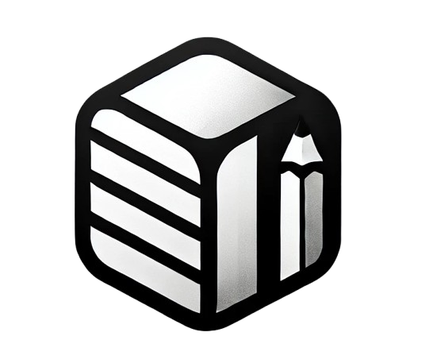

<a id="readme-top"></a>

<!-- PROJECT LOGO -->
<br />
<div align="center">
  <a href="https://github.com/MustafaLo/noted">
    
  </a>

  <h3 align="center">Noted</h3>

  <p align="center">
    A Notion-integrated CLI for effortless, in-context educational notes during development.
  </p>
</div>

<!-- TAGS -->
<div align="center">


[](https://opensource.org/licenses/MIT)


</div>


<!-- ABOUT THE PROJECT -->
## About The Project
Noted is a native CLI tool that integrates with Notion to provide a way for developers to write in-context, educational 
notes during development. Designed to help you jot down insights, explanations, or questions as you code, Noted lets you build your own library of knowledge to revisit and learn from—anytime, anywhere.

Here are some features:
* Tie notes to specific code line ranges for crystal-clear context.
* Sync directly with Notion to keep your learning organized and searchable.
* Automatically update existing Notion entries for evolving insights.
* Generate AI-powered summarizations of your knowledge base

<!-- GETTING STARTED -->
## Getting Started

Here are some instructions to get Noted working for you!

### Prerequisites

1. Currently, this tool is made exclusively for VSCode users. Enable the [Track Current File](https://marketplace.visualstudio.com/items?itemName=MustafaLo.currentfiletracker) extension which will generate metadata about your current active file.
2. Generate your [Notion API Key](https://developers.notion.com/docs/create-a-notion-integration#getting-started)
    ```sh
    #Add to your .env file
    NOTION_API_KEY=
    ```
3. [Share a page](https://developers.notion.com/docs/create-a-notion-integration#give-your-integration-page-permissions) in your workspace
    with your newly created integration and [save](https://developers.notion.com/docs/working-with-page-content#creating-a-page-with-content) the page's ID
    ```sh
    #Add to your .env file
    NOTION_PAGE_ID=
    ```

## Installation
There are a couple different methods to install Noted highlighted below

### Binary Releases
Download the latest binary for your OS from [Releases](https://github.com/MustafaLo/noted/releases)

### Homebrew
For macOS users you can install the CLI via the [Homebrew Package Manager](https://brew.sh/)
#### Tap
```sh
brew tap MustafaLo/mustafalo
```
#### Install
```sh
brew install noted
```

### Docker
The Docker image for noted is avalible [here](https://hub.docker.com/r/mustafalo/noted). Follow the docker installation instructions
[here](https://docs.docker.com/engine/install/)
#### Pull
```sh
docker pull mustafalo/noted:latest
```
#### Run
```sh
#Needs access to current working directory, hence the mount flag
docker run -v "$(pwd):/workdir" mustafalo/noted

#Optional alias to run the command
alias noted='docker run -v "$(pwd):/workdir" mustafalo/noted'

#Reload shell
source ~/.zshrc  # or source ~/.bashrc
```

### Go Users
If you already have Go installed on your system (or want to install [here](https://go.dev/doc/install))
```sh
go install github.com/MustafaLo/noted@latest
```
Ensure that the binary is in PATH or system location
```sh
# Move binary to PATH (add to ~/.zshrc or ~/.bashrc)
export PATH=$PATH:$(go env GOPATH)/bin

# Move binary to system location for universal access
sudo mv $(go env GOPATH)/bin/noted /usr/local/bin/
```
## Usage
Noted comes with a bunch of different features (and more coming!) to help you take and manage your notes effectively. Below are the key commands you can use. For details on all available flags and options, run any command with the `--help` or `-h` flag.

#### `note`
Capture your thoughts as you code! The `note` command allows you to attach notes to specific lines of your code, sync them with Notion, and update existing notes seamlessly. Whether it’s a quick reminder, a detailed explanation, or a question for later, `note` makes it easy to stay in the flow. Explore the full range of features by running:
```bash
noted note --help 
```

#### `list`
Quickly view all your notes in one place. The list command lets you browse your personal library of notes. See all the ways you can customize your list view with:
```bash
noted list --help
```

#### `insights`
This feature leverages Cohere's powerful AI to analyze your notes and provide personalized insights and summaries. 
> [!NOTE]
> To use this command, you'll need a free Cohere API key, which you can get [here](https://cohere.com/) and add to your .env file as `COHERE_API_KEY=`
```bash
noted insights --help
```
## Roadmap
Here are some future goals for Noted:
- [x] Support for syncing notes with Notion
- [x] AI-powered insights and summaries with Cohere
- [ ] Cross-platform support for additional IDEs beyond VSCode
- [ ] Collaborative note-sharing between team members
- [ ] Enhanced search functionality for notes within Notion

Feel free to submit a suggestion by opening an issue in the [issues section](https://github.com/MustafaLo/noted/issues)!

## License
This project is distributed under the MIT License

<p align="right">(<a href="#readme-top">back to top</a>)</p>

